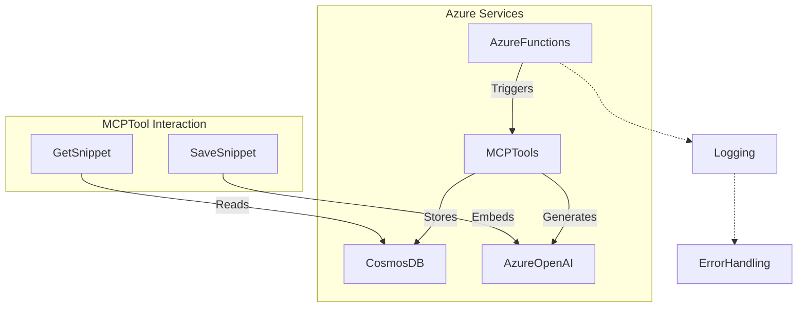
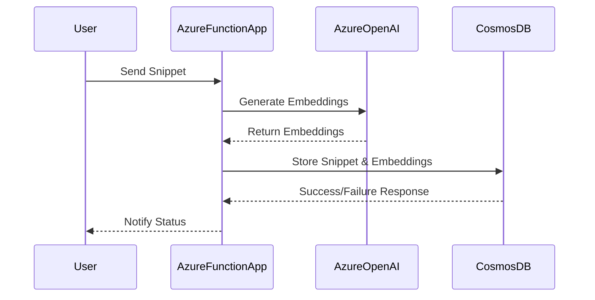

# Project Overview

This project is centered around the MCP (Model Context Protocol) tools designed for use with Azure Functions and AI-powered operations. The tools enable seamless integration with Azure OpenAI, Cosmos DB, and AI Agents to manage and analyze code snippets. Key functionalities include document management, vector search, error handling, logging, and provisioned cloud infrastructure using Bicep templates.

## Major Concepts

### MCP Tools

MCP tools automate operations related to code snippets using triggers that respond to Azure Function events. Tools such as `save_snippet`, `get_snippet`, `deep_wiki`, and `code_style` interact with various Azure services to provide a robust solution for code documentation and analysis.

### Azure Functions

Azure Functions provide the backbone for serverless execution, handling multiple types of triggers including HTTP and custom MCP triggers. The project leverages Azure Functions to perform backend operations with minimal infrastructure overhead.

### Cosmos DB & Vector Search

Cosmos DB is employed for document storage, utilizing its ability to handle JSON data. The integration includes vector search capabilities to enhance the retrieval process using embeddings generated by Azure OpenAI.

### Azure OpenAI

The project uses Azure OpenAI for advanced AI operations, particularly embedding text for vector-based searches and analysis. This enables intelligent handling and querying of code snippets.

### Error Handling & Logging

Error handling in the project is robust, utilizing Python's exception handling capabilities. Logging is crucial for diagnostics and is employed throughout the code to track operations and errors.

### Bicep Templates

Azure Bicep is used to define infrastructure as code, setting up Azure resources required for the operation of MCP tools. This involves complex parameter definitions and resource orchestration.

## Diagram Visualizations

### System Architecture



### Data Flow



## Snippet Catalog

| Snippet ID               | Language    | Purpose                                           |
|--------------------------|-------------|---------------------------------------------------|
| snip-func                | Python      | MCP tool trigger for saving snippets              |
| func-app-snippy          | Python      | Demonstrates Azure Functions with multiple services|
| main-bicep               | Bicep       | Infrastructure as code for Azure provisioning     |
| test-snippet-default-project | Python  | Simple print function                             |
| complex-snippet-default  | Python      | Basic Calculator class                            |

## Walkthroughs

### Saving a Snippet

1. **Send HTTP Request**: Utilize Azure Function to POST a code snippet.
   - Include required fields such as name and code.
2. **Generate Embeddings**: Azure OpenAI generates vector embeddings from code.
3. **Store in CosmosDB**: Snippet and embeddings are stored as a document.
4. **Logging & Error Handling**: Any errors during the procedure are logged and conveyed back to the user.

### Provisioning Resources

1. **Define Configuration**: Use Bicep templates to specify parameters and resources.
2. **Deploy Resources**: Execute the Bicep script to allocate Azure resources.
3. **Output Configuration**: Retrieve necessary configuration values post-deployment.

## Best Practices

- Ensure all Azure Function triggers are well-defined to avoid unexpected invocation issues.
- Use robust error handling to manage unforeseen runtime exceptions.
- Structure logging to capture crucial operational details for later analysis.
- Secure Bicep templates to prevent exposure of sensitive data and secrets.

## Anti-patterns

- Avoid hardcoding API keys in the code; use secure environment variables instead.
- Do not neglect validation of user input, which can lead to errors in processing.

## Open TODOs

- Implement a more granular logging system for detailed telemetry.
- Enhance support for additional programming languages beyond Python.
- Expand the capabilities of vector search to support more complex queries.

## Further Reading

- [Azure Functions Documentation](https://docs.microsoft.com/en-us/azure/azure-functions/functions-reference)
- [Cosmos DB Documentation](https://docs.microsoft.com/en-us/azure/cosmos-db/introduction)
- [Azure Bicep Documentation](https://docs.microsoft.com/en-us/azure/azure-resource-manager/bicep)
- [Azure OpenAI Documentation](https://docs.microsoft.com/en-us/azure/cognitive-services/openai/overview)

This documentation provides a comprehensive overview of the MCP tools project, detailing its architecture, functionality, and best practices.

# AI Agents Service Usage - Deep Wiki

## Project Overview

The AI Agents Service Usage project contains various code snippets that demonstrate diverse coding patterns and conventions. These snippets showcase the implementation of algorithms, APIs, design patterns, domain entities, error handling, logging, and more, specifically tailored for AI agent-enabled services.

## Key Concepts

### Algorithms
- **Search and Optimization**: Algorithms that are used to find optimal solutions and improve AI agent efficiency.
- **Machine Learning Models**: Code snippets demonstrating machine learning models that enable agents to make informed decisions.

### APIs
- **Service Integration**: Usage of APIs to integrate AI agents with third-party services to expand functionality.
- **RESTful Services**: Design and consumption of RESTful APIs to exchange data between components.

### Design Patterns
- **Singleton Pattern**: Ensures a class has only one instance and provides a global point of access to it.
- **Factory Pattern**: Provides a way to encapsulate object creation logic.
- **Observer Pattern**: Allows subscribers to listen for events and react accordingly, used for state management.

### Domain Entities
- **Agent Entity**: Represents intelligent agents with attributes essential for decision-making processes.
- **Service Entity**: Encompasses services used and provided by agents, including communication and task execution.

### Error Handling
- **Try-Catch Blocks**: Implementation of exception handling to manage runtime errors gracefully.
- **Logging**: Use of logging to trace and debug errors throughout the code execution lifecycle.

### Logging
- **Traceability**: Using logging frameworks to provide insights into the operation of AI agents.
- **Debugging**: Recording detailed information to aid in the troubleshooting of issues.

## Diagrams

### System Architecture

```mermaid
flowchart TD
    subgraph AI_Agent_System
        AgentNode["AI Agent"]
        ServiceNode["External Service"]
        DataNode["Data Storage"]
    end
    AgentNode -->|Requests data| ServiceNode
    ServiceNode -->|Sends data| DataNode
    AgentNode -->|Stores output| DataNode

    title System Architecture
    classDef entityClass fill:#f9f,stroke:#333,stroke-width:2px;
    ServiceNode:::entityClass
    AgentNode:::entityClass
    DataNode:::entityClass
```

### Call Graph of Major Functions

```mermaid
graph TD
    Start["Initialize Agent"]
    Decision1["Decision Making Process"]
    Execute1["Execute Actions"]
    Log1["Log Results"]

    Start --> Decision1
    Decision1 --> Execute1
    Execute1 --> Log1

    title Call Graph of Major Functions
```

## Snippet Catalog

| Snippet ID | Language | Purpose                               |
|------------|----------|---------------------------------------|
| 001        | Python   | AI agent data integration             |
| 002        | JavaScript | REST API communication              |
| 003        | Java     | Singleton pattern implementation      |
| 004        | C++      | Efficient error handling              |

## Step-by-Step Usage

1. **Initialize AI Agent**: Start by creating an instance of an AI agent utilizing the provided Singleton pattern.
2. **Integrate with Services**: Use the API snippets to enable communication between the AI agent and external services.
3. **Decision-Making**: Implement algorithms enabling agents to make decisions based on input data.
4. **Execute Actions**: Allow the agent to perform tasks and utilize the Factory pattern to create necessary objects.
5. **Log Results**: Capture logs for all actions performed for future analysis and debugging.

## Best Practices

- Utilize design patterns such as Singleton for managing instances and Factory for creating objects.
- Ensure API endpoints are properly secured and authenticated.
- Implement comprehensive logging to facilitate debugging and traceability.

## Anti-Patterns

- Avoid hard-coding values; utilize configuration files for better flexibility.
- Do not ignore caught exceptions; handle them appropriately to avoid silent failures.

## TODOs

- Enhance API security measures to meet industry standards.
- Implement more sophisticated error handling mechanisms.

## Further Reading

- [Design Patterns in Software Engineering](https://en.wikipedia.org/wiki/Design_Patterns)
- [Effective Machine Learning Strategies](https://towardsdatascience.com/a-guide-to-machine-learning-in-2023-38ea6619bfec)
- [Singleton Design Pattern](https://refactoring.guru/design-patterns/singleton)
- [Observer Design Pattern](https://en.wikipedia.org/wiki/Observer_pattern)

By following this guide, developers can effectively utilize the AI Agents Service Usage snippets, implement robust systems, and handle various operational aspects of AI-enabled services.